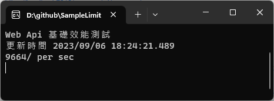
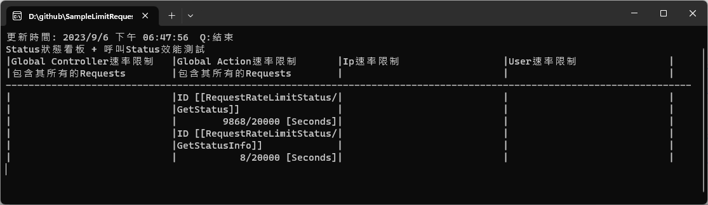

# SampleLimitRequestWebApi

# 未完成

## Service基礎效能測試 (Project:SampleLimitRequestTestServiceConsole)

## Web api基礎效能測試 (Project:SampleLimitRequestTestCountConsole)

## Status Console狀態看板 + 呼叫Status效能測試 (Project:SampleLimitRequestStatusConsole)

## 附註

### react vulnerability: nth-check
* https://github.com/facebook/create-react-app/issues/11647
* https://stackoverflow.com/questions/71282206/github-dependabot-alert-inefficient-regular-expression-complexity-in-nth-check
* 未處理

### openapi-generator-cli指令
* 下載
 * https://github.com/OpenAPITools/openapi-generator#13---download-jar
* 指令, 使用http不使用https
 * java -jar openapi-generator-cli.jar generate -i <swagger.json的http網址> -g csharp -o SampleLimitRequestTestConsole.ServerApis

### 使用openapi-generator作stress testing問題
* https://learn.microsoft.com/zh-tw/dotnet/architecture/microservices/implement-resilient-applications/use-httpclientfactory-to-implement-resilient-http-requests
* 在dot net 6, 應該是httpclient使用方式關係. 使用httpclientfactory建立的httpclient可以正常的使用stress testing