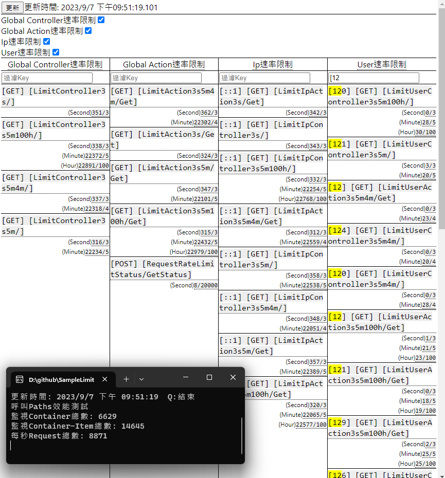

# SampleLimitRequestWebApi
* Request速率限制
* 和dot net 7新增的[速率限制](https://learn.microsoft.com/zh-tw/aspnet/core/performance/rate-limit?view=aspnetcore-7.0)不同
* 不論是否超出限制都會增加Amount
* 當Amount超出Limit時, 回傳HTTP status code 429

## RequestRateLimit專案
* 透過Attribute應用: GlobalRequestRateLimitAttribute, IpRequestRateLimitAttribute, UserRequestRateLimitAttribute使用
* GlobalRequestRateLimitAttribute: 任意Request計入相同的Amount
* IpRequestRateLimitAttribute: Ip相同時計入該Amount
* UserRequestRateLimitAttribute: UserId相同時計入該Amount
* 使用在Controller時, 為該Controller的所有Action都會計入
* 使用在Controller Action時, 該Action會計入

### Usage
```
[IpRequestRateLimit(30, RequestRateLimitPerTimeUnit.Seconds)]// 使用在Controller
public class LimitIpAction3sController : ControllerBase
{
    [HttpGet]
    [IpRequestRateLimit(3, RequestRateLimitPerTimeUnit.Seconds)]// 使用在Action
    public async Task<ActionResult<string>> Get()
    {
        return Ok();
    }
}
```

## Service基礎效能測試
* Project SampleLimitRequestTestServiceConsole


## Web api基礎效能測試
* 啟動2 Projects
  * SampleLimitRequestTestCountConsole
  * SampleLimitRequestWebApi
* 使用'不偵錯'測試效能


## Status Console狀態看板 + 呼叫Status效能測試
* 啟動2 Projects
  * SampleLimitRequestStatusConsole
  * SampleLimitRequestWebApi
* 使用'不偵錯'測試效能


## Status Web狀態看板 + 呼叫效能測試
* 啟動2 C# Projects
  * SampleLimitRequestTestPerformanceConsole
  * SampleLimitRequestWebApi
* C# Projects 使用'不偵錯'測試效能
* 啟動 React Project
  * sample-limit-request-status-web


## 附註

### react vulnerability: nth-check
* https://github.com/facebook/create-react-app/issues/11647
* https://stackoverflow.com/questions/71282206/github-dependabot-alert-inefficient-regular-expression-complexity-in-nth-check
* 未處理

### openapi-generator-cli指令
* 下載
 * https://github.com/OpenAPITools/openapi-generator#13---download-jar
* 指令, 使用http不使用https
 * java -jar openapi-generator-cli.jar generate -i <swagger.json的http網址> -g csharp -o SampleLimitRequestTestConsole.ServerApis

### 使用openapi-generator作stress testing問題
* https://learn.microsoft.com/zh-tw/dotnet/architecture/microservices/implement-resilient-applications/use-httpclientfactory-to-implement-resilient-http-requests
* 在dot net 6, 應該是httpclient使用方式關係. 使用httpclientfactory建立的httpclient可以正常的使用stress testing